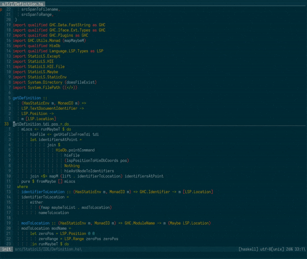
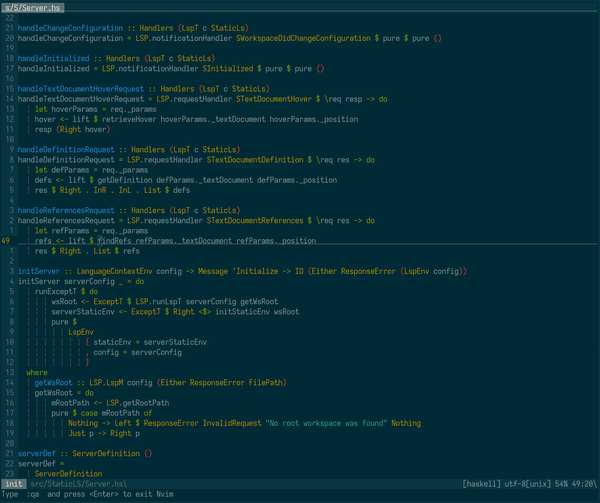
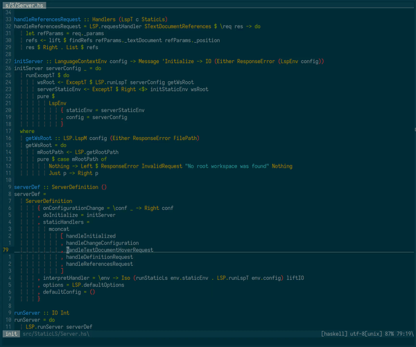

# static-ls

static-ls ("static language server") is a [hie files](https://gitlab.haskell.org/ghc/ghc/-/wikis/hie-files) and
[hiedb](https://github.com/wz1000/HieDb/) based language server heavily
inspired by [halfsp](https://github.com/masaeedu/halfsp), which reads static
project information to provide IDE functionality through the language server
protocol. `static-ls` will not generate this information on its own and instead
will rely on the user to generate this information via separate programs

See [Supported static sources](#Supported-static-sources) to see what is supported

The goal of `static-ls` is to provide a high-speed, low-memory language server for large
projects for which
[haskell-language-server](https://github.com/haskell/haskell-language-server)
tends to take up too much memory on recompilation.
[Haskell-language-server](https://github.com/haskell/haskell-language-server)
is recommended if you are not experiencing these issues. `static-ls` is meant
to work on enterprise size projects where aforementioned constraints can be an
issue. `static-ls` can work as a standalone code navigation tool if you generate
static sources once or can support a performant fully integrated editor
workflow with some setup and usage of a file watcher to recompile your project.

If you want to use `static-ls` in your IDE then
[ghciwatch](https://github.com/MercuryTechnologies/ghciwatch) for recompilation is strongly
recommended alongside `-fdefer-type-errors flag` for better UX
and the [ghc hiedb plugin](https://github.com/josephsumabat/hiedb-plugin) for re-indexing. 

Currently only ghc 9.4.4 and 9.6.1 are explicitly supported but I'm happy to add support for other versions of ghc if desired

(NOTE: The current version on hackage is out of date. Building from source is currently recommended.)

## Quick start

See [Advanced setup](docs/advanced-setup.md) for additional options

1. Compile your project with the following flags: 

    ```
    -fwrite-ide-info
    -hiedir .hiefiles
    ```
   You can also add `-hidir .hifiles` for haddock support (Only supported on 64
   bit systems right now) though this may also require some extra build
   configuration.

   Note if you don't want to change the output directories of these files you
   can symlink them instead or point `static-ls` to them with its arguments.
   (See `static-ls --help` for info)
    
    For a better UX, the following flags are *strongly* recommended.

     ```
     - -fdefer-type-errors
     - -Werror=deferred-type-errors
     - -Werror=deferred-out-of-scope-variables
     - -fno-defer-typed-holes
     ```
  
    These flags will allow hie files to be refreshed even if compilation fails to
    type check and will ensure that type check failures are still thrown as
    errors.

    - If you're using hpack you can add:
      ```
        ghc-options:
          - -fwrite-ide-info
          - -hiedir .hiefiles
          - -fdefer-type-errors
          - -Werror=deferred-type-errors
          - -Werror=deferred-out-of-scope-variables
          - -fno-defer-typed-holes
      ```
      to  your `package.yaml`. See this project's `package.yaml` or `static-ls.cabal` for examples
    - You may instead add the following to your `cabal.project.local` file:
      ```
      ignore-project: False
      program-options:
        ghc-options:
          -fdefer-type-errors
          -Werror=deferred-type-errors
          -Werror=deferred-out-of-scope-variables
          -fno-defer-typed-holes
      ```
    
2. You can index your project in hiedb running:
      ```
        hiedb -D .hiedb index .hiefiles --src-base-dir .
      ```

    from your workspace root. If you're on an older version of `hiedb` where the `--src-base-dir` argument is not available use:
    
      ```
        hiedb -D .hiedb index .hiefiles
      ```
    
    if you want to let ghc handle this automatically on recompilation you can
    use the [ghc hiedb plugin](https://github.com/josephsumabat/hiedb-plugin).
    Using it alongside ghciwatch is generally recommended for a better UX.

4. Point your language client to the `static-ls` binary and begin editing!
    (See [Editor Setup](#editor-setup) for instructions if you're not sure how)

[ghciwatch](https://github.com/MercuryTechnologies/ghciwatch) is recommended to
refresh hie files but compiling with `cabal build` should work as well

## Features

`static-ls` supports the following lsp methods:
- `textDocument/references`
  - Note that find references only works on top level definitions and can be
    slow for functions which are used frequently



- `textDocument/hover`
  - Provides type information and definition location on hover



- `textDocument/definition`
  - Works on both local and top level definitions



- Rename
- Go to Implementation
- Go to type definition
- Workspace symbols
- Document symbols
- Code actions
- Autocomplete

## Supported static sources

Below are supported static sources for ide information. Static-ls will not handle generating this information on its own but will require the user
to handle generating them.

| Static Source           | Default Director(y/ies)                                                      | static-ls argument          | Used For                                                                                                                                               | Description                                                                                                                                                                                              |
| -------------------     | ----------------------------                                                 | --------------------------- | ----------------------                                                                                                                                 | -----------------------------------------------------------------                                                                                                                                        |
| hie files               | .hiefiles/                                                                   | --hiefiles DIR              | Currently required for everything since AST is read from these.<br><br>Specifically used for:<br>- Type on hover<br>- go to definition/type definition | GHC generated annotated AST used to determine identifiers, type on hover, and go to definition at a given location<br><br>Using the `-hiefiles` flag in GHC will generate these                          |
| source code directories | - src/<br>- lib/<br>- app/<br>- test/<br><br>Will fallback to checking hiedb | --src-base-dirs DIR1,DIR2.. | - Go to definition                                                                                                                                     | Paths where source code is stored. Will assume that modules start at these directories                                                                                                                   |
| hiedb                   | .hiedb                                                                       | --hiedb TARGET              | - Go to definition (when not available in hie files)<br>- Find references<br>- Document Symbol                                                         | Indexed database of hie files. Used primarily for find references, but you can index dependencies or things not found in source code directories. Generated by [hiedb](https://github.com/wz1000/HieDb). |
| ghc interface files     | .hifiles/                                                                    | --hifiles TARGET            | - Docs on hover                                                                                                                                        | GHC generated interface files. Must be compiled with `-haddock` for docs. GHC will generate these automatically, but you can specify the output directory with `-hifiles`.                               |

Other potential sources of static information include haddock files as an alternative to interface files for docs, ghcid and hlint output for diagnostics, and ctags for a backup jump
to definition.
Future features using existing static sources include auto import resolution code actions, autocomplete based on hiedb, and call heiarchy

## Limitations
- Must be compiled on the same version of ghc as the project
- You will need to re-index your hie files once you edit your project

## Editor setup
Instructions for editor setup

### neovim - coc.nvim
call `:CocConfig` and copy the following in:
```
{
  "languageserver": {
    "static-ls": {
      "command": "static-ls",
      "rootPatterns": ["*.cabal", "stack.yaml", "cabal.project", "package.yaml", "hie.yaml"],
      "filetypes": ["haskell"]
    },
  },
}
```

### Visual Studio Code

You can technically use any LSP compliant client - for a generic one we generally recommend https://github.com/MercuryTechnologies/alloglot

1. Install the the alloglot language extension from the vscode store

2. In your workspace's or global `./vscode/settings.json` you can use the following:
```
{
  "alloglot.languages": [
    {
      "languageId": "haskell",
      "serverCommand": "static-ls",
    }
  ]
}
```
(Note `serverCommand` should be the path to your binary).

### Sublime Text

1. Install [Sublime Text LSP](https://lsp.sublimetext.io/) using [Sublime Text Package Manager](https://packagecontrol.io/installation).

2. Follow the [client configuration instructions](https://lsp.sublimetext.io/client_configuration/) to configure static-ls to launch when you open a Haskell file. You will need to add a new client:

```
{
  "clients": {
    "static_ls": {
      "enabled": true,
      "command": ["static-ls"],
      "selector": "source.haskell",
    },
  },
}
```

(Note `"command"` should point to your static-ls binary).

3. Some helpful LSP troubleshooting information can be found [here](https://lsp.sublimetext.io/troubleshooting/)
